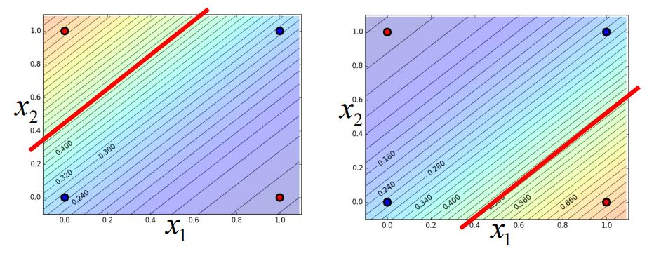
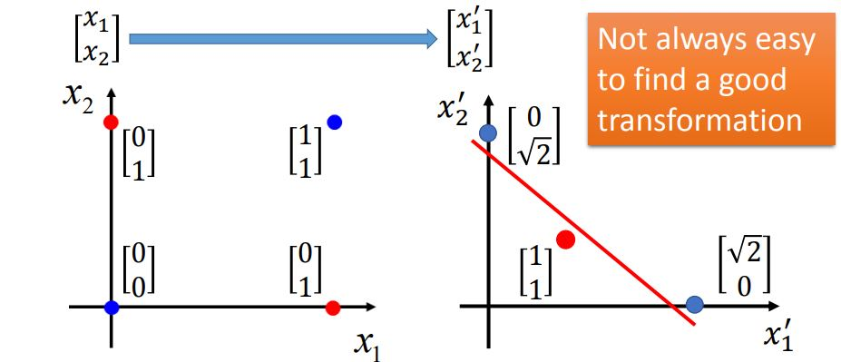
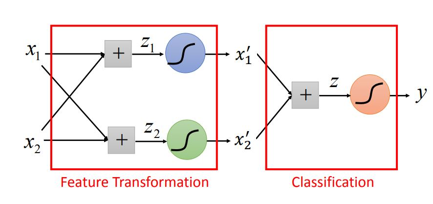
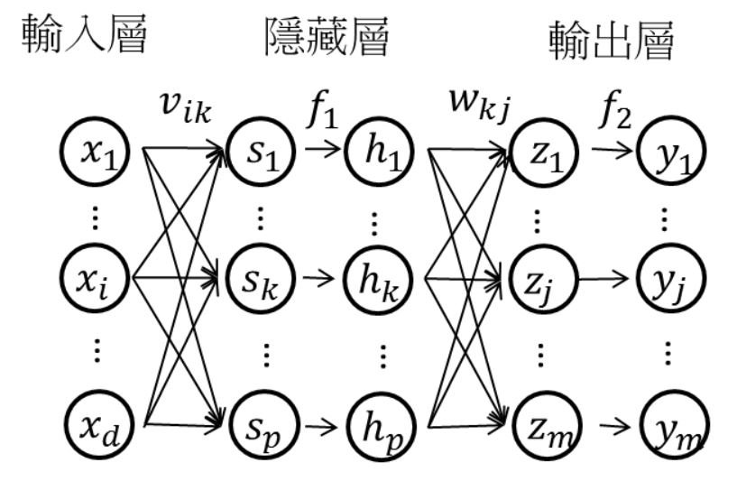
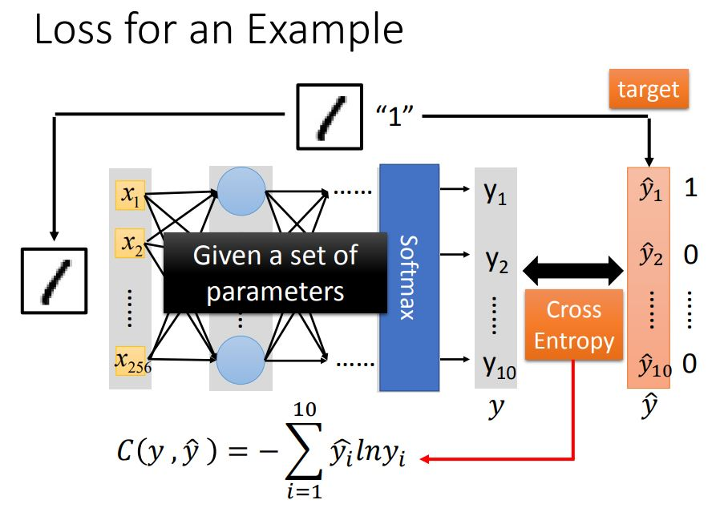

###### 本文內容節錄自Hung-yi Lee , Machine Learning(2017) 課程內容 
###### 本文圖片來自於李宏毅老師講義及Tommy Huang前輩於Medium之筆記內容

# Keras_MLP_simple

在單層神經網路系統當中只能找出一條線或一個平面，無論在圖中哪個位置放一條直線，都無法完美分割，所以不適合處理非線性的問題。

## 特徵轉換(Feature Transfer)
若堅持用線性的方式解此問題，可以做特徵轉換(Feature Transfer)，經過轉換後就能正確分割。

除了Input layer與Output layer之外中間隱含著Hidden layer，這就是一個最簡單的MLP。

多層感知機(MLP)其實是深度神經網路(DNN)的一種special case，概念基本一樣，只是DNN在學習的過程當中多了一些手法還有層數。

此程式為輸入18X18的阿拉伯數字圖片，透過Minst調整Neural Network的參數讓Cross Entropy越小越好。

